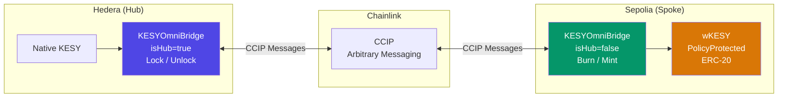
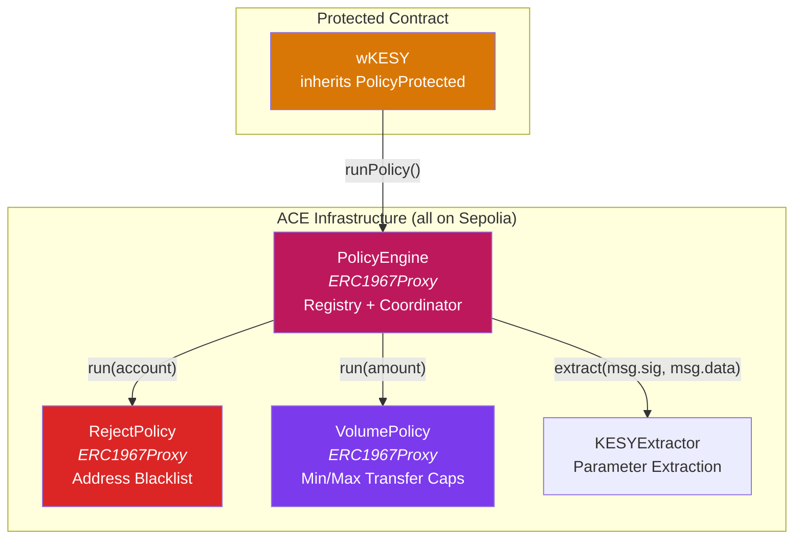
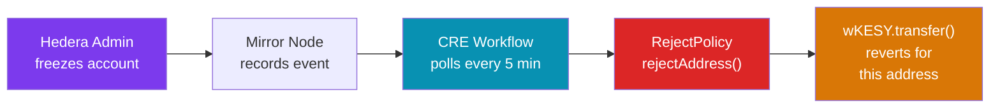
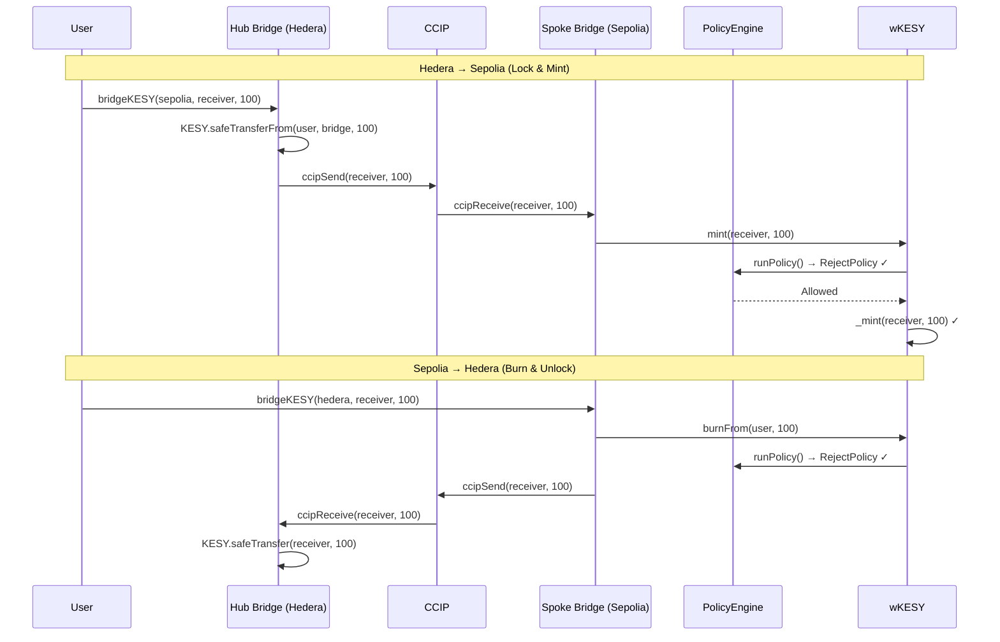

# KESY OmniBridge — Architecture

## System Overview

KESY is a regulated stablecoin issued as a native HTS token on Hedera. The OmniBridge brings it to EVM chains via Chainlink CCIP, with full compliance enforcement via **Chainlink ACE (Automated Compliance Engine)** and automated state sync via **CRE (Chainlink Runtime Environment)**.

---

## Hub-and-Spoke Model



A single `KESYOmniBridge.sol` is deployed on both chains, differentiated by `isHub`:

- **Hub (Hedera):** Locks native KESY on outbound, unlocks on inbound
- **Spoke (Sepolia):** Burns wKESY on outbound, mints on inbound

---

## ACE Compliance Layer

Chainlink ACE is a generalized on-chain policy framework. We use the real `@chainlink/policy-management` v1.0.0 package.

### Components



| Component | Role |
|-----------|------|
| **PolicyEngine** | Registry: maps `(contract, selector) → policies[]`. Runs policies in order. |
| **RejectPolicy** | Rejects ops if any address is on the reject list (`rejectAddress()` / `unrejectAddress()`) |
| **VolumePolicy** | Rejects ops if amount is below min or above max (`setMin()` / `setMax()`) |
| **KESYExtractor** | Parses calldata for `transfer`, `transferFrom`, `mint`, `burnFrom` → extracts `account` + `amount` |
| **wKESY** | Inherits `PolicyProtected`. Every token op calls `runPolicy()` before executing |

### Policy Configuration (how policies are attached)

```solidity
// Attach RejectPolicy to wKESY's transfer() selector
policyEngine.setExtractor(transferSelector, address(kesyExtractor));
policyEngine.addPolicy(
    address(wKESY),        // target contract
    transferSelector,       // function selector
    address(rejectPolicy),  // policy contract
    [keccak256("account")]  // parameter IDs to pass to policy
);
```

Policies are attached per `(contract address + function selector)` with specific `keccak256` parameter IDs. The extractor translates raw calldata into named parameters that policies understand.

### Protected Selectors

| Selector | RejectPolicy | VolumePolicy |
|----------|:---:|:---:|
| `transfer(address,uint256)` | ✅ checks `to` | ✅ checks `amount` |
| `transferFrom(address,address,uint256)` | ✅ checks `to` | ✅ checks `amount` |
| `mint(address,uint256)` | ✅ checks `to` | — |
| `burnFrom(address,uint256)` | ✅ checks `account` | — |

---

## CRE Compliance Sync Workflow



The CRE workflow monitors Hedera's Mirror Node for KESY freeze events and propagates them to the `RejectPolicy` on Sepolia. Currently, the `RejectPolicy.rejectAddress()` function is `onlyOwner`, so the CRE workflow's on-chain delivery targets the deployer address. In production, this would use a CRE Forwarder → ComplianceConsumer → RejectPolicy chain.

**Max propagation delay:** ~5 minutes (configurable via cron schedule)

---

## Bridge Flow



---

## Deployed Addresses (Testnet)

### Hedera Testnet

| Contract | Address |
|----------|---------|
| Hub Bridge | `0xD27c613C9d8D52C7E0BAE118562fB6cae7cC3A38` |
| Native KESY | `0x006E4dc3` (Token ID: 0.0.7228099) |

### Ethereum Sepolia

| Contract | Address |
|----------|---------|
| PolicyEngine (proxy) | `0x990D65f053c8Fa6Dfe43cF293534474B94F906a3` |
| RejectPolicy (proxy) | `0x366491aB0a574385B1795E24477D91BF2840c301` |
| VolumePolicy (proxy) | `0xA2899CAa08977408792aE767799d2144B5112469` |
| KESYExtractor | `0xaBCEf98127Da5DB87b41593E47a5d1a492bAA82b` |
| wKESY | `0xa3CC176553fbCe4Bb1270752d9c75464d21F6ba1` |
| Spoke Bridge | `0x4B0D9839db5962022E17fa8d61F3b6Ac8BB82a48` |
