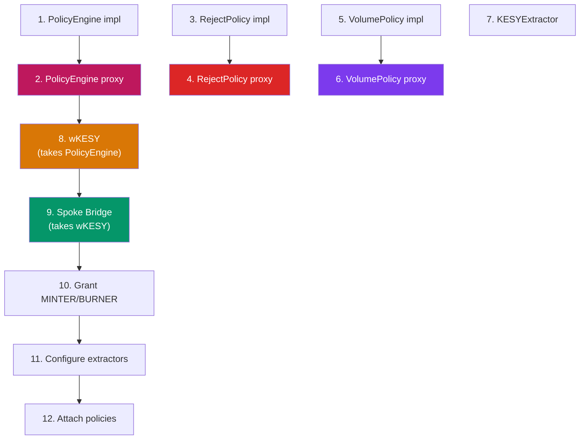

# KESY OmniBridge — Deployment Guide

## Prerequisites

- Foundry (`forge`, `cast`)
- Private key with testnet ETH (Sepolia) and HBAR (Hedera Testnet)
- LINK tokens on Sepolia (from [Chainlink Faucet](https://faucets.chain.link/sepolia))

---

## Environment Setup

```bash
cp .env.example .env
```

Required `.env` variables:
```env
PRIVATE_KEY=your_deployer_private_key
ETH_SEPOLIA_RPC_URL=https://ethereum-sepolia-rpc.publicnode.com
HEDERA_TESTNET_RPC_URL=https://testnet.hashio.io/api
```

---

## Deployment Steps

### Step 1: Deploy ACE + Token + Bridge to Sepolia

The deploy script creates everything in one transaction batch:

```bash
source .env
forge script script/DeploySepolia.s.sol --rpc-url $ETH_SEPOLIA_RPC_URL --broadcast
```

This deploys **8 contracts** in order:



### Step 2: Deploy Hub Bridge to Hedera

```bash
forge script script/DeployHedera.s.sol --rpc-url $HEDERA_TESTNET_RPC_URL --broadcast
```

### Step 3: Configure Allowlists

```bash
# Sepolia Spoke → recognize Hub
forge script script/ConfigureAllowlists.s.sol --rpc-url $ETH_SEPOLIA_RPC_URL --broadcast

# Hedera Hub → recognize new Spoke
forge script script/ConfigureAllowlists.s.sol --sig "runHedera()" --rpc-url $HEDERA_TESTNET_RPC_URL --broadcast
```

### Step 4: Fund with LINK

```bash
# Fund new Spoke Bridge with LINK
forge script script/FundSpoke.s.sol --rpc-url $ETH_SEPOLIA_RPC_URL --broadcast
```

---

## LINK Recovery (from old contracts)

If upgrading from a previous deployment:

```bash
forge script script/RecoverLink.s.sol --rpc-url $ETH_SEPOLIA_RPC_URL --broadcast
```

---

## ACE Compliance Management

### Blacklist an address (RejectPolicy)

```bash
# Add address to reject list
cast send $REJECT_POLICY "rejectAddress(address)" $TARGET_ADDRESS \
  --rpc-url $ETH_SEPOLIA_RPC_URL --private-key $PRIVATE_KEY

# Remove address from reject list
cast send $REJECT_POLICY "unrejectAddress(address)" $TARGET_ADDRESS \
  --rpc-url $ETH_SEPOLIA_RPC_URL --private-key $PRIVATE_KEY

# Check if address is rejected
cast call $REJECT_POLICY "addressRejected(address)(bool)" $TARGET_ADDRESS \
  --rpc-url $ETH_SEPOLIA_RPC_URL
```

### Set Volume Limits (VolumePolicy)

```bash
# Set max transfer at 10,000 KESY (6 decimals)
cast send $VOLUME_POLICY "setMax(uint256)" 10000000000 \
  --rpc-url $ETH_SEPOLIA_RPC_URL --private-key $PRIVATE_KEY

# Set min transfer at 1 KESY
cast send $VOLUME_POLICY "setMin(uint256)" 1000000 \
  --rpc-url $ETH_SEPOLIA_RPC_URL --private-key $PRIVATE_KEY
```

---

## Deployed Addresses (Current Testnet)

### Hedera Testnet
| Contract | Address |
|----------|---------|
| Hub Bridge | `0xD27c613C9d8D52C7E0BAE118562fB6cae7cC3A38` |
| Native KESY | `0x006E4dc3` (Token ID: 0.0.7228099) |

### Ethereum Sepolia
| Contract | Address |
|----------|---------|
| PolicyEngine (proxy) | `0x990D65f053c8Fa6Dfe43cF293534474B94F906a3` |
| RejectPolicy (proxy) | `0x366491aB0a574385B1795E24477D91BF2840c301` |
| VolumePolicy (proxy) | `0xA2899CAa08977408792aE767799d2144B5112469` |
| KESYExtractor | `0xaBCEf98127Da5DB87b41593E47a5d1a492bAA82b` |
| wKESY | `0xa3CC176553fbCe4Bb1270752d9c75464d21F6ba1` |
| Spoke Bridge | `0x4B0D9839db5962022E17fa8d61F3b6Ac8BB82a48` |

### Old Contracts (deprecated)
| Contract | Address | Status |
|----------|---------|--------|
| Old PolicyManager | `0x0eb38584703b9d22b757a5772211f78d8bae391d` | ❌ Replaced by ACE PolicyEngine |
| Old wKESY | `0xeE60AaAc2b6173f3Ff42ad3F1ff615d09100C4A7` | ❌ Replaced |
| Old Spoke Bridge | `0xbE6E85a565eE95Bb6bdFb8f98D5677f84e8686eE` | ❌ LINK recovered, replaced |