# KESY OmniBridge — Technical Overview

## What KESY Is

KESY is a **regulated stablecoin** issued as a native **HTS (Hedera Token Service) token** on Hedera. We've built a production-grade cross-chain bridge to bring it to EVM chains using Chainlink CCIP — with full compliance enforcement via the real **Chainlink ACE (Automated Compliance Engine)** and automated state sync via **CRE (Chainlink Runtime Environment)**.

---

## Architecture: Hub-and-Spoke via CCIP Arbitrary Messaging

```mermaid
graph TD
    subgraph "Hedera — Hub"
        KESY["🪙 Native KESY<br/><i>HTS Token · 0.0.7228099</i>"]
        HUB["🔐 KESYOmniBridge<br/><code>isHub = true</code><br/><i>Lock / Unlock</i>"]
    end

    subgraph "Chainlink Infrastructure"
        CCIP["🌐 CCIP<br/><i>Arbitrary Messaging</i>"]
        CRE["⚙️ CRE Workflow<br/><i>Compliance Sync</i>"]
    end

    subgraph "Ethereum Sepolia — Spoke"
        PE["🔧 PolicyEngine"]
        RP["🛡️ RejectPolicy"]
        VP["📊 VolumePolicy"]
        WKESY["🪙 wKESY<br/><i>PolicyProtected ERC-20</i>"]
        SPOKE["🔐 KESYOmniBridge<br/><code>isHub = false</code><br/><i>Burn / Mint</i>"]
    end

    KESY <-->|"Lock / Unlock"| HUB
    HUB <-->|"ccipSend / ccipReceive"| CCIP
    CCIP <-->|"ccipSend / ccipReceive"| SPOKE
    SPOKE <-->|"burnFrom / mint"| WKESY
    WKESY -->|"runPolicy()"| PE
    PE -->|"check account"| RP
    PE -->|"check amount"| VP
    CRE -.->|"rejectAddress()"| RP

    style HUB fill:#4F46E5,color:#fff
    style SPOKE fill:#059669,color:#fff
    style WKESY fill:#D97706,color:#fff
    style PE fill:#BE185D,color:#fff
    style RP fill:#DC2626,color:#fff
    style CRE fill:#0891B2,color:#fff
```



CCIP Arbitrary Messaging (not CCT token pools) is used because Hedera Testnet doesn't yet support native CCIP token pools due to HTS precompile complexities.

---

## Smart Contracts

### `wKESY.sol` — ACE-Protected ERC-20

Inherits Chainlink's real `PolicyProtected` from `@chainlink/policy-management`. Every token operation is gated by the `runPolicy()` modifier:

```solidity
contract wKESY is ERC20, ERC20Burnable, AccessControl, PolicyProtected {
    // All 4 ops are ACE-gated:
    function transfer(address to, uint256 amount) public override runPolicy returns (bool) { ... }
    function transferFrom(...) public override runPolicy returns (bool) { ... }
    function mint(address to, uint256 amount) public onlyRole(MINTER_ROLE) runPolicy { ... }
    function burnFrom(address account, uint256 amount) public override onlyRole(BURNER_ROLE) runPolicy { ... }
}
```

### `KESYExtractor.sol` — ACE Parameter Extractor

Parses calldata from all 4 wKESY selectors and outputs named parameters using the keccak256 convention:

```solidity
// For transfer(bob, 100):
PARAM_ACCOUNT = keccak256("account") → bob
PARAM_AMOUNT  = keccak256("amount")  → 100
```

### ACE Policies (from `@chainlink/policy-management`)

- **RejectPolicy** — rejects any operation where `account` is on the reject list
- **VolumePolicy** — rejects transfers where `amount` is outside configured min/max

---

## Security Model

| Layer | Mechanism |
|-------|-----------|
| **Transport** | CCIP Router-gated (`onlyRouter` on `ccipReceive`) |
| **Chain Auth** | Dual allowlists (chain selector + contract address) |
| **Compliance** | Chainlink ACE — PolicyEngine + RejectPolicy + VolumePolicy |
| **Automation** | CRE Workflow syncs Hedera HTS freeze events to RejectPolicy |
| **Token Access** | `MINTER_ROLE` / `BURNER_ROLE` restricted to bridge only |
| **Upgradeability** | ACE infra deployed behind ERC1967 proxies |

---

## Deployed Addresses (Testnet)

| Contract | Chain | Address |
|----------|-------|---------|
| **Hub Bridge** | Hedera | `0xD27c613C9d8D52C7E0BAE118562fB6cae7cC3A38` |
| **PolicyEngine** | Sepolia | `0x990D65f053c8Fa6Dfe43cF293534474B94F906a3` |
| **RejectPolicy** | Sepolia | `0x366491aB0a574385B1795E24477D91BF2840c301` |
| **VolumePolicy** | Sepolia | `0xA2899CAa08977408792aE767799d2144B5112469` |
| **KESYExtractor** | Sepolia | `0xaBCEf98127Da5DB87b41593E47a5d1a492bAA82b` |
| **wKESY** | Sepolia | `0xa3CC176553fbCe4Bb1270752d9c75464d21F6ba1` |
| **Spoke Bridge** | Sepolia | `0x4B0D9839db5962022E17fa8d61F3b6Ac8BB82a48` |
| **Native KESY** | Hedera | `0x006E4dc3` (Token ID: 0.0.7228099) |
