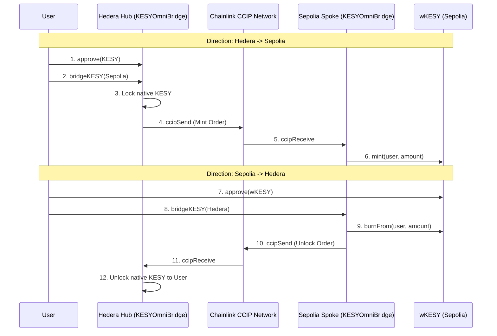
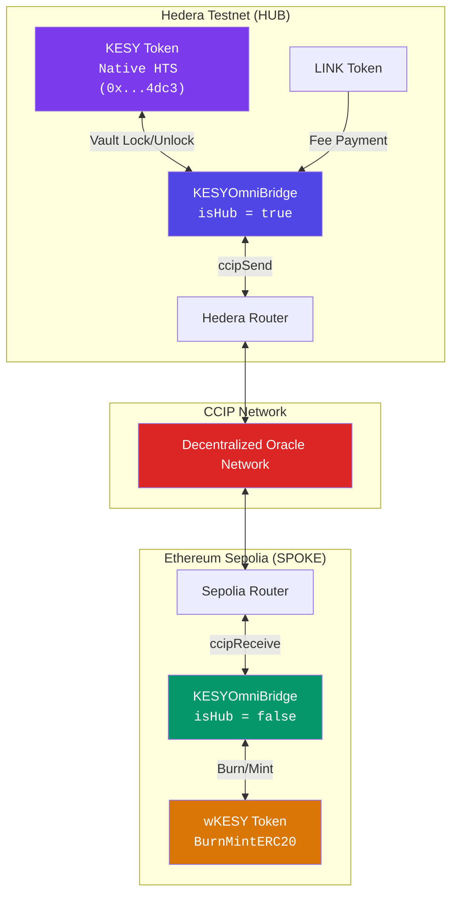

# KESY Bridge — Decentralized OmniBridge Guide

**Bi-Directional Bridging: Hedera Testnet ↔ Ethereum Sepolia**

*Powered by Chainlink CCIP & KESY Global Hub*

---

## Architecture Overview

The KESY OmniBridge enables seamless, secure, and bidirectional token transfers between Hedera and EVM-compatible chains. It implements a **Hub-and-Spoke** model to overcome Hedera's current lack of native CCIP Token Pools.

### Bridging Flow (Bi-Directional)

### Logical Infrastructure

## Contract & Network Reference

### Hedera Testnet (Hub)

| Item | Address / Value |
|------|----------------|
| **Hub Bridge** | [`0xD27c613C9d8D52C7E0BAE118562fB6cae7cC3A38`](https://hashscan.io/testnet/contract/0xD27c613C9d8D52C7E0BAE118562fB6cae7cC3A38) |
| **Native KESY** | [`0x00000000000000000000000000000000006E4dc3`](https://hashscan.io/testnet/token/0.0.7228099) |
| **CCIP Router** | `0x802C5F84eAD128Ff36fD6a3f8a418e339f467Ce4` |
| **LINK Token** | `0x90a386d59b9A6a4795a011e8f032Fc21ED6FEFb6` |
| **Chain Selector** | `222782988166878823` |

### Ethereum Sepolia (Spoke)

| Item | Address / Value |
|------|----------------|
| **Spoke Bridge** | [`0x5109Cd5e68e3182efeF8615C692989119aF76959`](https://sepolia.etherscan.io/address/0x5109Cd5e68e3182efeF8615C692989119aF76959) |
| **wKESY Token** | [`0x8Cff9519bb09f61B3A78e12572d569F071fd283A`](https://sepolia.etherscan.io/address/0x8Cff9519bb09f61B3A78e12572d569F071fd283A) |
| **CCIP Router** | `0x0BF3dE8c5D3e8A2B34D2BEeB17ABfCeBaf363A59` |
| **LINK Token** | `0x779877A7B0D9E8603169DdbD7836e478b4624789` |
| **Chain Selector** | `16015286601757825753` |

---

## Security Model

1. **Router Protection:** The `onlyRouter` modifier ensures that only official Chainlink delivery mechanisms can trigger the `ccipReceive` logic.
2. **Dual-Layer Allowlisting:**
   - **Chain-Level:** Rejects messages from unauthorized chain selectors.
   - **Contract-Level:** Rejects messages from unauthorized sender addresses to prevent impersonation.
3. **Immutability of Logic:** The roles are fixed; a Hub cannot burn tokens, and a Spoke cannot unlock tokens it doesn't hold.
4. **Dynamic Fee Calculation:** All transactions query `getFee()` in real-time to prevent underpayment or hardcoded gas failures.

## Testing & Operations

See [DEPLOYMENT.md](./DEPLOYMENT.md) for full deployment instructions and [ARCHITECTURE.md](./ARCHITECTURE.md) for deep technical implementation details.

---

**Built with ❤️ by the KESY Team using Chainlink CCIP**

