# KESY Bridge — Deployment & Interaction Guide

<div align="center">

**Cross-Chain Bridging: Hedera Testnet → Ethereum Sepolia**

*Powered by Chainlink CCIP Arbitrary Messaging*

</div>

---

## Table of Contents

- [Architecture Overview](#architecture-overview)
- [Contract Descriptions](#contract-descriptions)
- [Network & Address Reference](#network--address-reference)
- [Prerequisites](#prerequisites)
- [Step 1 — Deploy to Sepolia](#step-1--deploy-to-sepolia)
- [Step 2 — Deploy to Hedera Testnet](#step-2--deploy-to-hedera-testnet)
- [Step 3 — Cross-Allowlist](#step-3--cross-allowlist)
- [Step 4 — Fund the Bridge](#step-4--fund-the-bridge)
- [Step 5 — Bridge KESY Tokens](#step-5--bridge-kesy-tokens)
- [Tracking & Monitoring](#tracking--monitoring)
- [Security Model](#security-model)
- [Test Suite](#test-suite)
- [Future Upgrades](#future-upgrades)

---

## Architecture Overview

The KESY Bridge uses **Chainlink CCIP Arbitrary Messaging** to bridge KESY tokens from Hedera Testnet to Ethereum Sepolia. Instead of relying on CCIP's Cross-Chain Token (CCT) pools — which are not yet available on Hedera Testnet — we use a **lock-and-mint** pattern via encoded messages.

### High-Level Bridge Flow

```mermaid
sequenceDiagram
    participant User
    participant BridgeSender as BridgeSender<br/>(Hedera)
    participant CCIP as Chainlink CCIP<br/>Network
    participant BridgeReceiver as BridgeReceiver<br/>(Sepolia)
    participant wKESY as wKESY Token<br/>(Sepolia)

    User->>BridgeSender: 1. approve(KESY, amount)
    User->>BridgeSender: 2. bridgeKESY(sepoliaSelector, receiverBytes, amount)
    BridgeSender->>BridgeSender: 3. Lock KESY via transferFrom
    BridgeSender->>BridgeSender: 4. Encode (user, amount) as message data
    BridgeSender->>BridgeSender: 5. Quote fee via router.getFee()
    BridgeSender->>CCIP: 6. router.ccipSend() — pay LINK fee
    Note over CCIP: ~5-20 min finality
    CCIP->>BridgeReceiver: 7. router delivers Any2EVMMessage
    BridgeReceiver->>BridgeReceiver: 8. Verify source chain + sender allowlist
    BridgeReceiver->>BridgeReceiver: 9. Decode (user, amount) from data
    BridgeReceiver->>wKESY: 10. mint(user, amount)
    wKESY-->>User: 11. wKESY appears in wallet ✅
```



### Contract Relationship Diagram


---

## Contract Descriptions

### BridgeSender (Hedera Testnet)

The **sender-side** contract responsible for locking KESY tokens and dispatching a CCIP message to the destination chain.

| Feature | Detail |
|---------|--------|
| **Inherits** | `Ownable` (OpenZeppelin) |
| **Token Locking** | Locks KESY via `SafeERC20.safeTransferFrom` |
| **Message Encoding** | Packs `abi.encode(msg.sender, amount)` into `EVM2AnyMessage.data` |
| **Fee Payment** | Queries `router.getFee()` and pays in LINK |
| **Allowlists** | Destination chain selectors + receiver addresses (bytes) |
| **ExtraArgs** | Stored per-chain defaults OR per-call overrides for gas tuning |
| **Admin** | `withdrawToken()` for stuck token recovery |

**Key Functions:**

```solidity
// User-facing: bridge KESY to destination chain
function bridgeKESY(uint64 _destinationChainSelector, bytes calldata _receiver, uint256 _amount) external returns (bytes32 messageId)

// With custom gas settings
function bridgeKESYWithExtraArgs(uint64 _destinationChainSelector, bytes calldata _receiver, uint256 _amount, bytes calldata _extraArgs) external returns (bytes32 messageId)

// Admin: allowlisting
function allowlistDestinationChain(uint64 _destinationChainSelector, bool _allowed) external onlyOwner
function allowlistReceiver(uint64 _destinationChainSelector, bytes calldata _receiver, bool _allowed) external onlyOwner
function setDefaultExtraArgs(uint64 _destinationChainSelector, bytes calldata _extraArgs) external onlyOwner
```

### BridgeReceiver (Ethereum Sepolia)

The **receiver-side** contract that receives CCIP messages and mints wrapped tokens.

| Feature | Detail |
|---------|--------|
| **Inherits** | `CCIPReceiver`, `Ownable` |
| **Message Delivery** | Only the CCIP Router can call `ccipReceive()` (`onlyRouter` modifier) |
| **Allowlists** | Validates source chain selector + sender address before processing |
| **Token Minting** | Decodes `(user, amount)` and calls `wKESY.mint(user, amount)` |

**Key Functions:**

```solidity
// Internal: called by CCIP Router — DO NOT call directly
function _ccipReceive(Client.Any2EVMMessage memory any2EvmMessage) internal override

// Admin: allowlisting
function allowlistSourceChain(uint64 _sourceChainSelector, bool _allowed) external onlyOwner
function allowlistSender(uint64 _sourceChainSelector, bytes calldata _sender, bool _allowed) external onlyOwner
```

### wKESY Token (Ethereum Sepolia)

The **wrapped representation** of KESY on Sepolia.

| Feature | Detail |
|---------|--------|
| **Standard** | ERC-20 (`Wrapped KESY` / `wKESY`) |
| **Access Control** | OpenZeppelin `AccessControl` with `MINTER_ROLE` |
| **Minting** | Only addresses with `MINTER_ROLE` (i.e., `BridgeReceiver`) can mint |
| **Burning** | Any holder can burn their own tokens |

---

## Network & Address Reference

### Hedera Testnet

| Item | Address / Value |
|------|----------------|
| **CCIP Router** | `0x802C5F84eAD128Ff36fD6a3f8a418e339f467Ce4` |
| **LINK Token** | `0x90a386d59b9A6a4795a011e8f032Fc21ED6FEFb6` |
| **KESY Token** | `0x00000000000000000000000000000000006E4dc3` |
| **Chain Selector** | `222782988166878823` |
| **Explorer** | [hashscan.io/testnet](https://hashscan.io/testnet) |

### Ethereum Sepolia

| Item | Address / Value |
|------|----------------|
| **CCIP Router** | `0x0BF3dE8c5D3e8A2B34D2BEeB17ABfCeBaf363A59` |
| **LINK Token** | `0x779877A7B0D9E8603169DdbD7836e478b4624789` |
| **Chain Selector** | `16015286601757825753` |
| **Explorer** | [sepolia.etherscan.io](https://sepolia.etherscan.io) |

### Deployed Contract Addresses

| Contract | Chain | Address |
|----------|-------|---------|
| **BridgeSender** | Hedera Testnet | [`0x96e33252bF39a4cCDb683097238b1cd8baF194F3`](https://hashscan.io/testnet/contract/0x96e33252bF39a4cCDb683097238b1cd8baF194F3) |
| **BridgeReceiver** | Sepolia | [`0x55C6bf3481Fc9830016e3F22c69abB919d439daD`](https://sepolia.etherscan.io/address/0x55C6bf3481Fc9830016e3F22c69abB919d439daD) |
| **wKESY** | Sepolia | [`0x52b8bbc75dfdb9c4ff067585d35f38b5bfa322a1`](https://sepolia.etherscan.io/address/0x52b8bbc75dfdb9c4ff067585d35f38b5bfa322a1) |

---

## Prerequisites

### 1. Install Foundry

```bash
curl -L https://foundry.paradigm.xyz | bash
foundryup
```

### 2. Clone & Install Dependencies

```bash
cd contracts
forge install
```

### 3. Configure Environment

```bash
cp .env.example .env
```

Edit `.env` with your values:

```env
PRIVATE_KEY=0xYOUR_DEPLOYER_PRIVATE_KEY
HEDERA_TESTNET_RPC_URL=https://testnet.hashio.io/api
ETH_SEPOLIA_RPC_URL=https://rpc.ankr.com/eth_sepolia
```

### 4. Fund Your Deployer Wallet

| Chain | What You Need | Where to Get |
|-------|---------------|-------------|
| Hedera Testnet | HBAR (gas) | [portal.hedera.com](https://portal.hedera.com) |
| Hedera Testnet | LINK (bridge fees) | [faucets.chain.link](https://faucets.chain.link) |
| Sepolia | SepoliaETH (gas) | [sepoliafaucet.com](https://sepoliafaucet.com) |

### 5. Build & Test

```bash
forge build
forge test -vv
```

Expected output:
```
Ran 4 test suites: 32 tests passed, 0 failed, 0 skipped
```

---

## Step 1 — Deploy to Sepolia

> [!NOTE]
> We deploy Sepolia first because we need the `BridgeReceiver` address to allowlist it on Hedera.

```bash
source .env

forge script script/DeploySepolia.s.sol:DeploySepolia \
  --rpc-url $ETH_SEPOLIA_RPC_URL \
  --broadcast \
  -vvvv
```

**What this does:**


**Save the output addresses:**

```
wKESY deployed at:          0x...
BridgeReceiver deployed at: 0x...
```

---

## Step 2 — Deploy to Hedera Testnet

Set the `BridgeReceiver` address from Step 1:

```bash
export BRIDGE_RECEIVER_ADDRESS=0x_YOUR_RECEIVER_ADDRESS_FROM_STEP_1

forge script script/DeployHedera.s.sol:DeployHedera \
  --rpc-url $HEDERA_TESTNET_RPC_URL \
  --broadcast \
  -vvvv
```

**What this does:**


**Save the output address:**

```
BridgeSender deployed at: 0x...
```

---

## Step 3 — Cross-Allowlist

The BridgeReceiver on Sepolia needs to allowlist the BridgeSender from Hedera. Use `cast` to call the function:

```bash
cast send $BRIDGE_RECEIVER_ADDRESS \
  "allowlistSender(uint64,bytes,bool)" \
  222782988166878823 \
  $(cast abi-encode "f(address)" $BRIDGE_SENDER_ADDRESS) \
  true \
  --rpc-url $ETH_SEPOLIA_RPC_URL \
  --private-key $PRIVATE_KEY
```

### Verify the Full Configuration

```bash
# On Sepolia — check BridgeReceiver allowlists
cast call $BRIDGE_RECEIVER_ADDRESS \
  "s_allowlistedSourceChains(uint64)(bool)" \
  222782988166878823 \
  --rpc-url $ETH_SEPOLIA_RPC_URL
# Expected: true

# On Hedera — check BridgeSender allowlists
cast call $BRIDGE_SENDER_ADDRESS \
  "s_allowlistedChains(uint64)(bool)" \
  16015286601757825753 \
  --rpc-url $HEDERA_TESTNET_RPC_URL
# Expected: true
```

---

## Step 4 — Fund the Bridge

### Fund BridgeSender with LINK (Hedera Testnet)

The BridgeSender needs LINK tokens to pay CCIP message fees. Transfer LINK from your wallet:

```bash
# Approve and transfer LINK to BridgeSender
cast send 0x90a386d59b9A6a4795a011e8f032Fc21ED6FEFb6 \
  "transfer(address,uint256)(bool)" \
  $BRIDGE_SENDER_ADDRESS \
  5000000000000000000 \
  --rpc-url $HEDERA_TESTNET_RPC_URL \
  --private-key $PRIVATE_KEY
```

> [!TIP]
> 5 LINK (5e18 wei) is sufficient for approximately 50+ bridge transactions on testnet. Each CCIP message costs roughly 0.05–0.1 LINK.

### Verify LINK Balance

```bash
cast call 0x90a386d59b9A6a4795a011e8f032Fc21ED6FEFb6 \
  "balanceOf(address)(uint256)" \
  $BRIDGE_SENDER_ADDRESS \
  --rpc-url $HEDERA_TESTNET_RPC_URL
```

---

## Step 5 — Bridge KESY Tokens

### User Flow

```mermaid
graph TD
    A["1️⃣ User approves KESY<br/>for BridgeSender"] --> B["2️⃣ User calls bridgeKESY()"]
    B --> C{"3️⃣ BridgeSender<br/>checks allowlists"}
    C -->|"✅ Allowed"| D["4️⃣ KESY locked in contract"]
    C -->|"❌ Not allowed"| E["Revert"]
    D --> F["5️⃣ CCIP message sent<br/>+ LINK fee paid"]
    F --> G["6️⃣ Wait ~5-20 min"]
    G --> H["7️⃣ BridgeReceiver<br/>receives message"]
    H --> I["8️⃣ wKESY minted<br/>to user wallet 🎉"]

    style A fill:#f0f0f0,color:#333
    style B fill:#4F46E5,color:#fff
    style D fill:#7C3AED,color:#fff
    style F fill:#DC2626,color:#fff
    style H fill:#059669,color:#fff
    style I fill:#D97706,color:#fff
    style E fill:#EF4444,color:#fff
```



### Using `cast` (CLI)

```bash
# 1. Approve KESY for BridgeSender
AMOUNT=1000000000000000000000  # 1000 KESY (18 decimals)

cast send 0x00000000000000000000000000000000006E4dc3 \
  "approve(address,uint256)(bool)" \
  $BRIDGE_SENDER_ADDRESS \
  $AMOUNT \
  --rpc-url $HEDERA_TESTNET_RPC_URL \
  --private-key $PRIVATE_KEY

# 2. Bridge KESY
RECEIVER_BYTES=$(cast abi-encode "f(address)" $BRIDGE_RECEIVER_ADDRESS)

cast send $BRIDGE_SENDER_ADDRESS \
  "bridgeKESY(uint64,bytes,uint256)(bytes32)" \
  16015286601757825753 \
  $RECEIVER_BYTES \
  $AMOUNT \
  --rpc-url $HEDERA_TESTNET_RPC_URL \
  --private-key $PRIVATE_KEY
```

### Using Ethers.js / Web3

```javascript
// 1. Approve KESY
const amount = ethers.parseEther("1000");
await kesyToken.approve(bridgeSenderAddress, amount);

// 2. Bridge
const sepoliaSelector = 16015286601757825753n;
const receiverBytes = ethers.AbiCoder.defaultAbiCoder().encode(
  ["address"],
  [bridgeReceiverAddress]
);

const tx = await bridgeSender.bridgeKESY(
  sepoliaSelector,
  receiverBytes,
  amount
);
const receipt = await tx.wait();

// 3. Extract messageId from MessageSent event
const messageId = receipt.logs.find(
  (log) => log.topics[0] === bridgeSender.interface.getEvent("MessageSent").topicHash
).topics[1];

console.log("CCIP Message ID:", messageId);
```

### Check wKESY Balance on Sepolia

After ~5-20 minutes:

```bash
cast call $WKESY_ADDRESS \
  "balanceOf(address)(uint256)" \
  $YOUR_ADDRESS \
  --rpc-url $ETH_SEPOLIA_RPC_URL
```

---

## Tracking & Monitoring

### CCIP Explorer

Track your cross-chain message status at:

```
https://ccip.chain.link/msg/{messageId}
```

### Events to Monitor

**On Hedera (source):**

| Event | Fields | Meaning |
|-------|--------|---------|
| `MessageSent` | `messageId`, `destinationChainSelector`, `receiver`, `sender`, `amount`, `fees` | CCIP message dispatched |

**On Sepolia (destination):**

| Event | Fields | Meaning |
|-------|--------|---------|
| `MessageReceived` | `messageId`, `sourceChainSelector`, `sender`, `user`, `amount` | Message processed, wKESY minted |

### Query Events with `cast`

```bash
# Recent MessageSent events on Hedera
cast logs --from-block latest \
  --address $BRIDGE_SENDER_ADDRESS \
  --rpc-url $HEDERA_TESTNET_RPC_URL

# Recent MessageReceived events on Sepolia
cast logs --from-block latest \
  --address $BRIDGE_RECEIVER_ADDRESS \
  --rpc-url $ETH_SEPOLIA_RPC_URL
```

---

## Security Model

```mermaid
graph TD
    subgraph "Defense Layers"
        A["🔒 Router-Gated Delivery<br/><code>onlyRouter</code> modifier"]
        B["🔗 Source Chain Allowlist<br/>Only accepted chain selectors"]
        C["📍 Sender Allowlist<br/>Only known contract addresses"]
        D["👤 Owner-Only Admin<br/><code>onlyOwner</code> on all config"]
        E["💰 On-Chain Fee Quoting<br/>No hardcoded gas assumptions"]
        F["🔑 Role-Based Minting<br/><code>MINTER_ROLE</code> via AccessControl"]
    end

    A --> B --> C --> D
    D --> E --> F

    style A fill:#DC2626,color:#fff
    style B fill:#D97706,color:#fff
    style C fill:#059669,color:#fff
    style D fill:#4F46E5,color:#fff
    style E fill:#7C3AED,color:#fff
    style F fill:#EC4899,color:#fff
```



| Layer | Contract | Protection |
|-------|----------|-----------|
| **Router Gating** | `BridgeReceiver` | Only the CCIP Router can deliver messages via `onlyRouter` |
| **Source Chain Allowlist** | `BridgeReceiver` | Rejects messages from non-allowlisted chain selectors |
| **Sender Allowlist** | `BridgeReceiver` | Rejects messages from non-allowlisted sender contracts |
| **Destination Allowlist** | `BridgeSender` | Won't send to non-allowlisted chains |
| **Receiver Allowlist** | `BridgeSender` | Won't send to non-allowlisted receiver addresses |
| **Dynamic ExtraArgs** | `BridgeSender` | Per-chain gas settings avoid hardcoded assumptions |
| **Fee Quoting** | `BridgeSender` | Always quotes fees on-chain before sending |
| **Role-Based Minting** | `wKESY` | Only `MINTER_ROLE` holders (BridgeReceiver) can mint |
| **Token Recovery** | `BridgeSender` | Owner can withdraw stuck tokens via `withdrawToken()` |

---

## Test Suite

All contracts are thoroughly tested using **Foundry** with **Chainlink's CCIPLocalSimulator** for realistic CCIP message simulation.

```
forge test -vv
```

### Test Coverage Summary

| Test File | Tests | Description |
|-----------|-------|-------------|
| `wKESY.t.sol` | 9 | Mint, burn, access control, fuzz, metadata |
| `BridgeReceiver.t.sol` | 6 | ccipReceive, router gating, allowlists, access control |
| `BridgeSender.t.sol` | 14 | Happy path, all revert paths, admin controls, event emission, fuzz |
| `E2E.t.sol` | 3 | Full bridge flow, multiple bridges, fuzz on amounts |
| **Total** | **32** | **All passing ✅** |

### Key Test Highlights

- **End-to-End Tests**: Using `CCIPLocalSimulator`, we simulate the full flow — KESY lock → CCIP message dispatch → auto-delivery → wKESY minting — all in a single transaction
- **Fuzz Tests**: Randomized bridge amounts to catch edge cases
- **Revert Tests**: Every failure path is tested with exact error selectors
- **Access Control**: All `onlyOwner` and role-based guards verified

---

## Future Upgrades


---

<div align="center">

**Built with ❤️ using Chainlink CCIP & Foundry**

[Chainlink CCIP Docs](https://docs.chain.link/ccip) · [Foundry Book](https://book.getfoundry.sh) · [CCIP Explorer](https://ccip.chain.link)

</div>
