# KESY OmniBridge — Contracts

<div align="center">

**Cross-Chain KESY Token Bridge · Chainlink CCIP + ACE**

*Hub-and-Spoke Architecture with Automated Compliance Enforcement*

</div>

---

## Architecture


---

## Deployed Addresses (Testnet)

### Hedera Testnet

| Contract | Address |
|----------|---------|
| **Hub Bridge** | [`0xD27c613C9d8D52C7E0BAE118562fB6cae7cC3A38`](https://hashscan.io/testnet/contract/0xD27c613C9d8D52C7E0BAE118562fB6cae7cC3A38) |
| **Native KESY** | [`0x006E4dc3`](https://hashscan.io/testnet/token/0.0.7228099) |

### Ethereum Sepolia

| Contract | Address |
|----------|---------|
| **PolicyEngine** (proxy) | [`0x990D65f053c8Fa6Dfe43cF293534474B94F906a3`](https://sepolia.etherscan.io/address/0x990D65f053c8Fa6Dfe43cF293534474B94F906a3) |
| **RejectPolicy** (proxy) | [`0x366491aB0a574385B1795E24477D91BF2840c301`](https://sepolia.etherscan.io/address/0x366491aB0a574385B1795E24477D91BF2840c301) |
| **VolumePolicy** (proxy) | [`0xA2899CAa08977408792aE767799d2144B5112469`](https://sepolia.etherscan.io/address/0xA2899CAa08977408792aE767799d2144B5112469) |
| **KESYExtractor** | [`0xaBCEf98127Da5DB87b41593E47a5d1a492bAA82b`](https://sepolia.etherscan.io/address/0xaBCEf98127Da5DB87b41593E47a5d1a492bAA82b) |
| **wKESY** | [`0xa3CC176553fbCe4Bb1270752d9c75464d21F6ba1`](https://sepolia.etherscan.io/address/0xa3CC176553fbCe4Bb1270752d9c75464d21F6ba1) |
| **Spoke Bridge** | [`0x4B0D9839db5962022E17fa8d61F3b6Ac8BB82a48`](https://sepolia.etherscan.io/address/0x4B0D9839db5962022E17fa8d61F3b6Ac8BB82a48) |

---

## Contract Summary

| Contract | Purpose |
|----------|---------|
| `KESYOmniBridge.sol` | CCIP bridge — locks/unlocks on Hub, burns/mints on Spoke |
| `wKESY.sol` | ACE-protected ERC-20, inherits `PolicyProtected` |
| `KESYExtractor.sol` | ACE parameter extractor for all wKESY selectors |
| `PolicyManager.sol` | *(removed — replaced by real ACE PolicyEngine)* |

---

## How ACE Enforcement Works

```mermaid
sequenceDiagram
    participant User
    participant wKESY
    participant PolicyEngine
    participant KESYExtractor
    participant RejectPolicy
    participant VolumePolicy

    User->>wKESY: transfer(bob, 100)
    Note over wKESY: runPolicy() modifier fires
    wKESY->>PolicyEngine: run(selector=transfer, data)
    PolicyEngine->>KESYExtractor: extract(payload)
    KESYExtractor-->>PolicyEngine: {account: bob, amount: 100}
    PolicyEngine->>RejectPolicy: run(account=bob)
    RejectPolicy-->>PolicyEngine: CONTINUE ✓
    PolicyEngine->>VolumePolicy: run(amount=100)
    VolumePolicy-->>PolicyEngine: CONTINUE ✓
    PolicyEngine-->>wKESY: All policies passed
    wKESY->>wKESY: super.transfer(bob, 100) ✓
```



---

## Quick Start

```bash
# Install dependencies
forge install

# Build
forge build

# Test (all 20 pass)
forge test -vv

# Deploy to Sepolia
source .env && forge script script/DeploySepolia.s.sol --rpc-url $ETH_SEPOLIA_RPC_URL --broadcast
```

---

## Security Model

| Layer | Mechanism |
|-------|-----------|
| **Transport** | CCIP Router-gated (`onlyRouter`) |
| **Chain Auth** | Chain selector + sender address allowlisting |
| **Compliance** | Chainlink ACE `PolicyEngine` + `RejectPolicy` + `VolumePolicy` |
| **Automation** | CRE Workflow syncs Hedera freeze state to `RejectPolicy` |
| **Token Access** | `MINTER_ROLE` / `BURNER_ROLE` restricted to bridge only |
| **Upgradeable** | ACE policies deployed behind ERC1967 proxies |