# KESY Compliance Sync Workflow

<div align="center">

**Chainlink CRE · Automated Cross-Chain Compliance**

*Hedera Mirror Node → CRE DON → ACE RejectPolicy on Sepolia*

</div>

---

## What This Workflow Does

This workflow is the **automated compliance bridge** between Hedera's native freeze/unfreeze capabilities (HTS) and the on-chain ACE `RejectPolicy` that guards every `wKESY` token operation on Sepolia via Chainlink's Automated Compliance Engine.

Without this workflow, a Hedera admin would need to manually freeze on Hedera *and* separately submit a transaction on every EVM chain. With CRE, this is fully automated.

---

## Architecture


---

## Execution Flow

```mermaid
sequenceDiagram
    participant CRE as CRE Workflow
    participant MN as Mirror Node API
    participant DON as DON Consensus
    participant RP as RejectPolicy (Sepolia)
    participant wKESY as wKESY Token

    Note over CRE: ⏰ Cron fires (every 5 min)
    CRE->>MN: GET /api/v1/tokens/0.0.7228099/balances
    MN-->>CRE: { balances: [{account, balance}] }
    CRE->>CRE: Filter frozen accounts
    alt No frozen accounts
        CRE->>CRE: Log "No updates needed"
    else Found frozen accounts
        CRE->>CRE: encodeFunctionData(rejectAddress, [addr])
        CRE->>DON: runtime.report(encodedPayload)
        DON-->>CRE: Signed report (ecdsa + keccak256)
        CRE->>RP: evmClient.writeReport(receiver, report)
        RP-->>RP: rejectList[addr] = true
        Note over RP,wKESY: Next wKESY op → PolicyEngine →<br/>RejectPolicy → ❌ PolicyRejected
    end
```



---

## Workflow Code Highlights

### 1. Cron Trigger → Mirror Node Poll

```typescript
// Fetch from Hedera Mirror Node inside DON consensus
const frozenCount = runtime.runInNodeMode(
    (nodeRuntime) => {
        const httpClient = new cre.capabilities.HTTPClient();
        const response = httpClient.sendRequest(nodeRuntime, {
            url: `${config.hederaMirrorUrl}/api/v1/tokens/${config.hederaKesyTokenId}/balances`,
            method: "GET",
        }).result();
        // Parse response and count frozen accounts
        return accounts.length;
    },
    consensusMedianAggregation(),
)().result();
```

### 2. DON-Signed Report → EVM Delivery

```typescript
// Encode rejectAddress(addr) calldata
const calldata = encodeFunctionData({
    abi: RejectPolicyABI,
    functionName: "rejectAddress",
    args: [frozenAddress],
});

// Generate DON-signed report
const report = runtime.report({
    encodedPayload: hexToBase64(calldata),
    encoderName: "evm",
    signingAlgo: "ecdsa",
    hashingAlgo: "keccak256",
}).result();

// Deliver to RejectPolicy on Sepolia
const resp = evmClient.writeReport(runtime, {
    receiver: config.rejectPolicyAddress,
    report: report,
    gasConfig: { gasLimit: "200000" },
}).result();
```

---

## Configuration

### `config.staging.json`

```json
{
  "schedule": "*/300 * * * * *",
  "hederaMirrorUrl": "https://testnet.mirrornode.hedera.com",
  "hederaKesyTokenId": "0.0.7228099",
  "sepoliaChainSelector": "16015286601757825753",
  "rejectPolicyAddress": "0x366491aB0a574385B1795E24477D91BF2840c301"
}
```

| Field | Description |
|-------|-------------|
| `schedule` | Cron expression (e.g., `*/300 * * * * *` = every 5 min) |
| `hederaMirrorUrl` | Hedera Mirror Node base URL |
| `hederaKesyTokenId` | KESY token ID on Hedera |
| `sepoliaChainSelector` | CCIP chain selector for Sepolia (`16015286601757825753`) |
| `rejectPolicyAddress` | Deployed ACE RejectPolicy on Sepolia |

---

## Setup & Running

### Install dependencies

```bash
cd kesy-bridge-workflow && bun install
```

### Configure `.env`

```env
CRE_ETH_PRIVATE_KEY=<your-funded-sepolia-private-key>
CRE_TARGET=staging-settings
```

### Simulate locally

```bash
# From the kesy-bridge project root:
cre workflow simulate ./kesy-bridge-workflow --target=staging-settings
```

### Deploy to CRE network

```bash
cre workflow deploy ./kesy-bridge-workflow --target=staging-settings
```

---

## Deployed Addresses

| Contract | Chain | Address |
|----------|-------|---------|
| **PolicyEngine** | Sepolia | [`0x990D65f053c8Fa6Dfe43cF293534474B94F906a3`](https://sepolia.etherscan.io/address/0x990D65f053c8Fa6Dfe43cF293534474B94F906a3) |
| **RejectPolicy** | Sepolia | [`0x366491aB0a574385B1795E24477D91BF2840c301`](https://sepolia.etherscan.io/address/0x366491aB0a574385B1795E24477D91BF2840c301) |
| **VolumePolicy** | Sepolia | [`0xA2899CAa08977408792aE767799d2144B5112469`](https://sepolia.etherscan.io/address/0xA2899CAa08977408792aE767799d2144B5112469) |
| **wKESY Token** | Sepolia | [`0xa3CC176553fbCe4Bb1270752d9c75464d21F6ba1`](https://sepolia.etherscan.io/address/0xa3CC176553fbCe4Bb1270752d9c75464d21F6ba1) |
| **Spoke Bridge** | Sepolia | [`0x4B0D9839db5962022E17fa8d61F3b6Ac8BB82a48`](https://sepolia.etherscan.io/address/0x4B0D9839db5962022E17fa8d61F3b6Ac8BB82a48) |
| **Hub Bridge** | Hedera Testnet | [`0xD27c613C9d8D52C7E0BAE118562fB6cae7cC3A38`](https://hashscan.io/testnet/contract/0xD27c613C9d8D52C7E0BAE118562fB6cae7cC3A38) |

---

## End-to-End Compliance Picture

```mermaid
graph LR
    A["Hedera Admin<br/>freezes account"] --> B["Mirror Node<br/>records event"]
    B --> C["CRE Workflow<br/>polls every 5 min"]
    C --> D["RejectPolicy<br/>rejectAddress()"]
    D --> E["wKESY.transfer()<br/>PolicyEngine → RejectPolicy<br/>→ ❌ PolicyRejected"]

    style A fill:#7C3AED,color:#fff
    style C fill:#0891B2,color:#fff
    style D fill:#BE185D,color:#fff
    style E fill:#DC2626,color:#fff
```



> **Max propagation delay:** ~5 minutes (configurable via cron schedule)
>
> **Coverage:** All EVM Spoke chains that share the same ACE pattern — deploy a new Spoke with its own PolicyEngine + RejectPolicy, point CRE at its RejectPolicy address, and compliance auto-propagates from day one.
